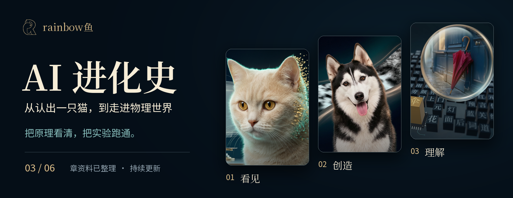
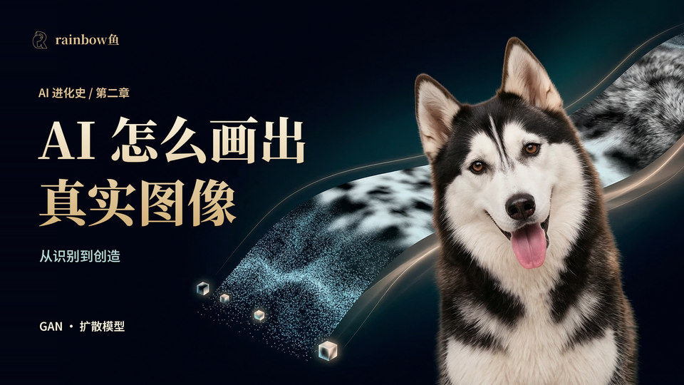
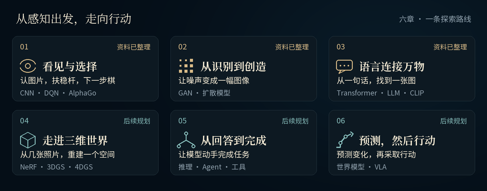
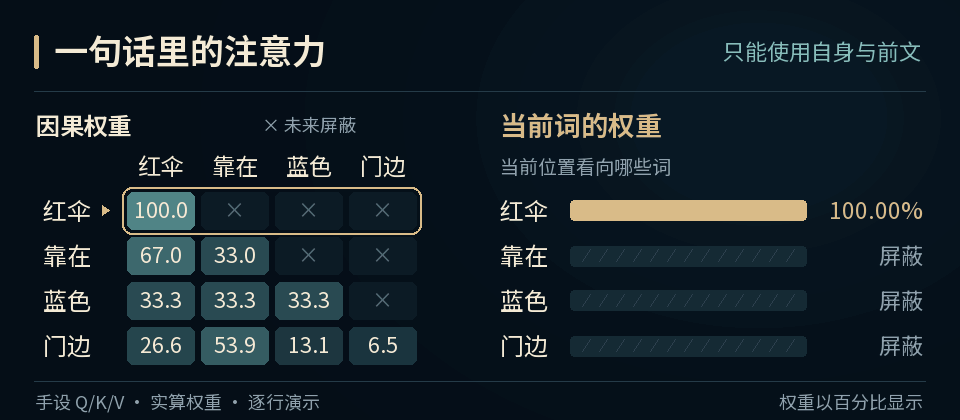
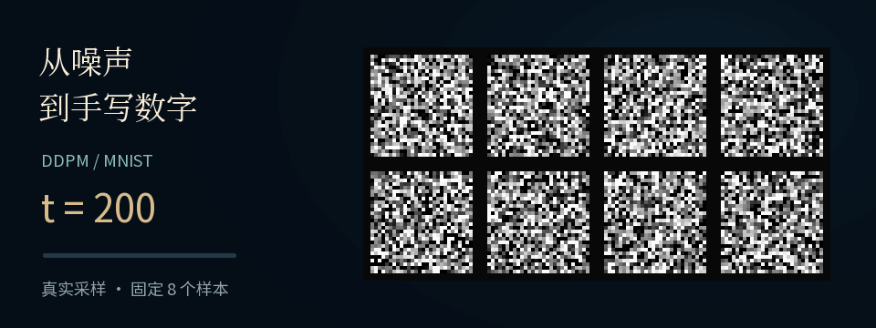

<p align="center">
  
</p>

<p align="center">
  <strong>AI 怎样走到今天？它怎样工作？我们能用它做什么？</strong><br>
  从认出一只猫，到生成图像、理解一句话。<br>
  rainbow鱼 用可视化、真实实验和原始论文，把 AI 背后的计算过程拆开讲清楚。
</p>

<p align="center">
  <a href="overview/README.md">先看系列总览</a> ·
  <a href="#六章一条探索路线">选择章节</a> ·
  <a href="#让知识动起来">动手做实验</a> ·
  <a href="shared/README.md">创作与维护</a>
</p>

<p align="center">
  <a href="https://github.com/rainbowyuyu/AI_revolution/actions/workflows/check.yml"></a><br>
  <sub>6 章计划 · 总览 + 3 章资料已整理 · rainbow鱼 持续创作</sub>
</p>

> **最新整理 · 第三章《语言连接万物》**<br>
> 从“红伞靠在蓝色门边”出发，亲手分词、算注意力，再用一句话找图片。<br>
> [读图文讲义](chapters/03-language-multimodal/docs/图文讲义.md) · [运行实验](chapters/03-language-multimodal/docs/实验复现.md) · [查 10 篇论文](chapters/03-language-multimodal/docs/论文索引.md)

## 从一个问题出发

<table>
  <tr>
    <td width="50%" valign="top">
      <a href="overview/README.md"></a>
      <h3>先把整张地图展开</h3>
      <p>从看见，到创造，再到走进物理世界。六章讲什么、对应哪些技术，从这里展开。</p>
      <a href="overview/README.md"><strong>进入系列总览 →</strong></a>
    </td>
    <td width="50%" valign="top">
      <a href="chapters/01-vision-choice/README.md"></a>
      <h3>电脑怎样认出一只猫？</h3>
      <p>认图片、扶稳平衡杆、提前比较落子。三个真实实验串起 CNN、DQN 与树搜索。</p>
      <a href="chapters/01-vision-choice/README.md"><strong>第一章 · 开始探索 →</strong></a>
    </td>
  </tr>
  <tr>
    <td width="50%" valign="top">
      <a href="chapters/02-generation/README.md"></a>
      <h3>一团噪声怎样变成图像？</h3>
      <p>运行八峰分布与手写数字实验，观察 GAN 怎样学习分布、DDPM 怎样逐步去噪。</p>
      <a href="chapters/02-generation/README.md"><strong>第二章 · 开始探索 →</strong></a>
    </td>
    <td width="50%" valign="top">
      <a href="chapters/03-language-multimodal/README.md"></a>
      <h3>AI 如何理解一句话？</h3>
      <p>亲手分词、计算注意力、生成下一字符，再观察图文检索为什么会选错。</p>
      <a href="chapters/03-language-multimodal/README.md"><strong>第三章 · 开始探索 →</strong></a>
    </td>
  </tr>
</table>

**前三章已整理：讲解与来源、实验与结果、字幕与讲稿、动画工程与封面。** 第四至六章保留规划入口；各章的完整目录与操作说明都放在章内。

## 六章，一条探索路线



| 章节 | 带着这个问题进入 | 进度 |
|---|---|---|
| **[01 · 看见与选择](chapters/01-vision-choice/README.md)** | 像素怎样成为判断？反馈怎样改变行动？ | 资料已整理 |
| **[02 · 从识别到创造](chapters/02-generation/README.md)** | 随机数怎样生成图像？怎样让图像符合条件？ | 资料已整理 |
| **[03 · 语言连接万物](chapters/03-language-multimodal/README.md)** | 文字、图像和声音怎样建立联系？ | 资料已整理 |
| **[04 · 走进三维世界](chapters/04-space-time/README.md)** | 几张照片，怎样变成可以绕行的空间？ | 规划中 |
| **[05 · 从回答到完成](chapters/05-reasoning-agents/README.md)** | 怎样让 AI 查资料、运行代码、完成任务？ | 规划中 |
| **[06 · 预测，然后行动](chapters/06-world-action/README.md)** | 怎样预测变化，并把语言连接到真实动作？ | 规划中 |

<sub>路线表示本系列的讲解顺序。各章当前版本与完整技术目录以章内说明为准。</sub>

## 让知识动起来

**读到“门边”时，注意力怎样分配给前面的词？**

<a href="chapters/03-language-multimodal/docs/图文讲义.md"></a>

这张动图展示第三章的小型注意力计算：手动设定 Q/K/V，观察每个位置如何分配权重；后面的词暂时不可见。数据来自仓库保存的计算结果，改动输入后，可以自己重算并比较。[打开实验](chapters/03-language-multimodal/docs/实验复现.md) · [理解公式](chapters/03-language-multimodal/docs/图文讲义.md)

<details>
<summary><strong>再看一个：一团噪声怎样变成手写数字？</strong></summary>

<a href="chapters/02-generation/docs/图文讲义.md"></a>

上面的动图回放第二章保存的真实 DDPM 采样帧。同一组数字逐渐显现，公式、代码与每一步结果都能在章内对照查看。[运行生成实验](chapters/02-generation/docs/实验复现.md)

</details>

**选一个问题，亲手试出来：**

| 看见与选择 | 从识别到创造 | 语言连接万物 |
|---|---|---|
| [认图片 → 控制平衡杆 → 四子棋搜索](chapters/01-vision-choice/docs/复现实验.md) | [生成八团点 → 生成手写数字](chapters/02-generation/docs/实验复现.md) | [分词 → 注意力 → 续写 → 图文检索](chapters/03-language-multimodal/docs/实验复现.md) |
| [实际结果与失败案例](chapters/01-vision-choice/docs/实验结果.md) | [训练结果与采样过程](chapters/02-generation/docs/实验结果.md) | [裁掉红车，为什么会改变检索结果？](chapters/03-language-multimodal/docs/实验结果.md) |

<details>
<summary><strong>第一次来，怎么选择阅读方式？</strong></summary>

- **想先听懂：** 从系列总览开始；第一章按三个任务阅读，第二、三章有图文讲义。
- **想自己做：** 进入对应章节的实验指南，先短运行，再看完整训练与评估。
- **想读得更深：** 沿论文索引，找到讲解对应的原始图示、公式和算法。
- **想继续创作：** 查看本章视频工程，再进入[共用制作规范](shared/README.md)。

</details>

<details>
<summary><strong>资料怎样组织？</strong></summary>

```text
AI_revolution/
├─ README.md       # 你正在看的系列统一入口
├─ overview/       # 总览：说明、源码、字幕、论文、封面
├─ chapters/       # 六章：每章自带完整资料与使用说明
├─ shared/         # 共用规范、模板、首页素材与维护记录
├─ tools/          # 仓库级检查和维护工具
└─ series.json     # 系列进度与版本登记
```

已整理章节的实验代码与结果随仓库保存；模型依赖按各章说明准备。完整成片、音轨及大型媒体按章内清单恢复。后续的章节内容与操作说明都写在章节内部。[目录维护约定](shared/docs/MAINTENANCE.md)

</details>

---

<p align="center">
  <strong>把一次“原来如此”，变成一次“我也试出来了”。</strong><br>
  <a href="https://github.com/rainbowyuyu/AI_revolution/issues">交流问题与实验结果</a> ·
  <a href="shared/README.md">共用资料</a> ·
  <a href="LICENSE.md">使用范围</a> ·
  <a href="shared/docs/THIRD_PARTY_NOTICES.md">来源与署名</a>
</p>
