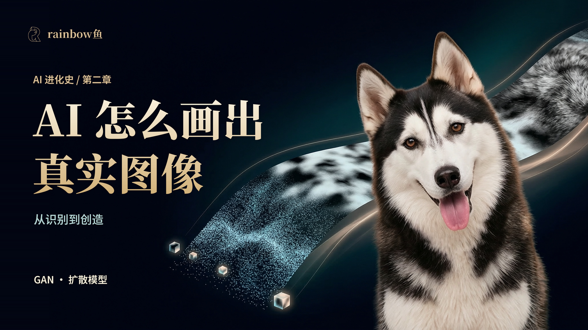

# 第二章 · 从识别到创造



**AI 怎么画出真实图像？** 跟着小狗踏雪，从随机数和数据分布出发，走过 GAN 的对抗训练、扩散模型的逐步去噪，再理解条件控制、潜空间和图像编辑。

当前资料对应 **V18，1920×1080，30 fps，54,724 帧，30 分 24 秒**。配套资料与真实实验已完成整理；4K 交付版由 1080p 升采样。GitHub 保存可编辑源码与学习材料，成片和大型媒体保留在原制作工程及备份中。

[返回系列](../../README.md) · [上一章：看见与选择](../01-vision-choice/README.md) · [下一章：语言连接万物](../03-language-multimodal/README.md)

## 选择你的入口

| 你想做什么 | 从这里开始 |
|---|---|
| 先看懂 GAN 和扩散模型 | [图文讲义](docs/图文讲义.md) |
| 跟着视频找某个概念 | [59 段时间导航](supplements/章节时间索引.md)、[完整口播](supplements/口播.md) |
| 下载字幕 | [V18 中文字幕：524 条](supplements/中文字幕_V18.srt) |
| 自己运行生成实验 | [实验复现](docs/实验复现.md)、[真实实验结果](docs/实验结果.md) |
| 查论文、继续深入 | [7 篇论文索引](docs/论文索引.md) |
| 理解踏雪的条件生成示例 | [角色与图像生成](docs/图像生成与角色示例.md) |
| 修改动画、恢复视频工程 | [视频工程](docs/视频工程.md) |
| 查看封面、平台文案和署名 | [第二章发布资料](publication/2026-09-29/README.md)、[音乐署名](docs/音乐来源与署名.md) |

## 这一章讲什么

1. 从踏雪的外观与动作引入：生成图像需要学习什么，怎样描述一组可能的结果。
2. GAN：生成器把随机数变为样本，判别器提供反馈；交替训练怎样推动分布变化，模式坍塌怎样出现。
3. 真实实验：二维八峰分布与手写数字，直接观察训练记录、生成样本和插值。
4. 扩散模型：已知噪声怎样构造训练题目，预测噪声怎样帮助逐步采样，训练与生成分别更新什么。
5. 走向应用：采样效率、潜空间、条件控制、CFG、编辑及角色连续性。
6. 回到论文：按真实论文的图示和算法逐篇阅读，连接直觉、公式与代码。

## 可以亲手复现的实验

| 实验 | 设置 | 随仓库保留的结果 |
|---|---|---|
| 二维八峰 GAN / DDPM | 种子 12、25、2003；每模型每种子 6,000 次更新 | 六组权重、训练记录、2,048 点采样、去噪轨迹与分布指标 |
| MNIST GAN / DDPM | 种子 42；每模型 3,000 次更新；DDPM 200 步采样 | 两组权重、50 张训练/采样过程图、结果与验证记录 |

在保存的八峰任务中，GAN 与 DDPM 的平均近邻比例分别为 **43.95% 与 94.08%**；这衡量生成点落入指定中心邻域的比例。MNIST DDPM 的已记录验证噪声 MSE 为 **0.04484**，来自验证部分的前 512 张图。完整定义、种子、数据划分与局限见[实验结果](docs/实验结果.md)。这些小模型展示点与数字的生成，踏雪由独立的参考条件创作流程产生。

从仓库根目录运行下面的检查，无需 GPU 或付费服务：

```sh
python chapters/02-generation/experiments/check_evidence.py
```

安装实验依赖后，可以先做短运行：

```sh
python -m pip install -r chapters/02-generation/requirements-experiments.txt
python chapters/02-generation/experiments/train_distributions_v5.py --smoke --device cpu --run-dir runs/ch02-dist-smoke
python chapters/02-generation/experiments/train_digits.py --smoke --device cpu --run-dir runs/ch02-digits-smoke
```

建议使用独立 Python 3.12 环境。数字实验首次运行会下载约 9.9 MB 的 MNIST 图像并校验摘要；所有新结果写入新空目录。完整训练、设备选项及深度核查命令见[实验复现](docs/实验复现.md)。

## 目录与维护

```text
02-generation/
├─ chapter.json                   # 当前版本、时长、主题、资料入口
├─ experiments/                   # 可移植训练与证据核查
│  └─ original/                   # 保留原字节的两份历史源码
├─ results/                       # 原始结果、数字过程图、证据清单
├─ checkpoints/                   # 八个小型实验权重
├─ src/                           # V18 当前依赖的 Remotion 场景与时间线
├─ public/experiments/            # 噪声预测/特征图，数字图通过脚本恢复
├─ scripts/                       # 素材恢复、清单维护、可选缓存重建
├─ assets/video-manifest.json     # 165 项外部媒体的相对路径与 SHA-256
├─ supplements/                  # 讲稿、字幕、59 段导航与时间线
├─ docs/                         # 讲义、实验、论文、工程、音乐来源
├─ requirements-experiments.txt  # Python 实验最小依赖
└─ package.json / package-lock.json # Node.js 动画依赖与锁文件
```

视频使用 `src/index-v18.tsx`，合成 ID 为 `Chapter02-V18-1080`。在本章目录执行 `npm ci`、`npm run check` 可检查源码；完整预览前按[工程说明](docs/视频工程.md)恢复外部素材。小型实验数据已在 Git 中，单独学习或训练无需恢复约 1.53 GiB 的视频素材。

当前依赖中保留少量旧版文件名和内部场景 ID；它们仍服务于 V18。请按依赖和素材清单维护，不按版本数字批量删除。源码默认直接解码原视频，历史 JPEG 缓存可选，不能承诺重新渲染与历史母版逐像素相同。

本次核查覆盖 63 项历史证据哈希、8 个权重重载、六组二维重新采样及 MNIST CUDA 200 步重采样；数字终图像素差为 0。CPU/CUDA 短运行均通过。见[实验检查报告](results/verification-2026-09-29.json)与[资料同步记录](docs/maintenance/第二章资料同步-2026-09-29.md)。本次资料整理没有重新全量训练或重新导出成片。

原创内容与第三方材料的权限见 [LICENSE.md](../../LICENSE.md) 和 [THIRD_PARTY_NOTICES.md](../../shared/docs/THIRD_PARTY_NOTICES.md)。
