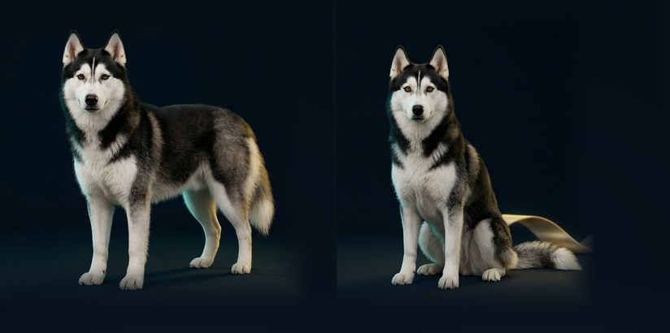

# 图像生成与角色示例：让她仍然像踏雪

本章用踏雪连接“生成机制”和“实际创作”。她是黑白长毛、棕色眼睛、鼻梁白纹、四只白爪的角色。参考条件生成的目标是：改变场景、姿态或光线时，仍能从多处外形线索认出她。

左图来自正式采用的站姿工作室场景，右图来自正式采用的坐姿场景。这里只对原生成图做相同区域裁切、等比缩小与并排排版，保留可见的耳尖、脚爪和尾巴。它们展示本章选用的两个结果，不代表完整候选集的成功率。

## 这些图从哪里来

制作时以用户提供的踏雪多视角形象作为角色参考，使用 Qwen 2.0 Pro 进行参考图编辑/生成，正式采用图保存为 `public/character/v15/studio.png` 与 `gallery.png`。本页使用的轻量衍生图和输入文件 SHA256 记录在 [图片来源](images/sources.json) 中。V18 的角色画面继承这一素材体系。

这些结果来自已训练的大型生成模型。本仓库内的二维与 MNIST 小模型学习的是坐标分布或数字笔画，没有训练生成踏雪的毛发、姿态或场景。对应的真实小实验见 [实验结果](实验结果.md)。

本章动作素材使用过 Wan 2.6 图生视频与 Wan 2.2 关键帧视频等工具；用于“收舌、坐下”连续动作分析的是正式选用的 Wan 3.0 Prime 30 秒镜头。本页仅解释使用过程和检查方法，不提供无需服务端模型即可重建这些镜头的承诺。生成工具的实际内部实现不能由外观推断为某篇论文的原样实现。

## 把要求拆成可观察的条件

| 条件 | 交给模型的信息 | 查看结果时检查什么 |
|---|---|---|
| 主体身份 | 一致的参考图、名字与外形描述 | 脸型、鼻梁白纹、棕色眼睛、黑白毛色是否同时吻合 |
| 姿态 | 站立、坐下、收舌等具体动作 | 四肢数量、关节方向、身体比例与支撑关系 |
| 场景 | 背景、空间和光照要求 | 是否实现要求，光影与主体是否协调 |
| 构图 | 主体位置、取景范围与教学留白 | 耳朵、脚爪、尾巴是否完整，是否挡住文字 |
| 时间 | 连续动作与稳定镜头 | 相邻帧是否漂移、变形或突然换毛色 |

“画一只黑白小狗”允许许多不同身份；参考图提供了文字难以完整描述的脸型和纹理。身份判断要看多处线索的组合，不能只凭某只白爪或一块白毛。条件更强也不保证更好，需要同时看条件符合度和画面自然度。

## 可复用的提示词组织方式

下面是教学用提示词模板，不是本章 API 请求的原样导出。将它与自己有权使用的参考图配合，并按工具支持的输入方式调整：

> 使用参考图中的同一位角色踏雪。保留她的黑白长毛、棕色眼睛、鼻梁白纹、四只白爪、脸型与身体比例。让她站在深色工作室地面上，光线柔和、接地阴影自然。全身入镜，完整保留耳朵、脚爪与尾巴，主体在右侧，左侧留出教学文字空间。

需要动作时，用一个短动作先验证，例如“固定机位，踏雪自然收起舌头，随后缓慢坐下，坐稳后保持安静”。一次同时改变主体、场景、镜头和动作，会让失败原因更难定位。实际接口的编辑强度、引导强度和参考权重并非同一个参数，数值也不跨工具通用。

## 从图像检查延伸到视频

先在固定时刻比较白纹、眼睛、耳朵、四肢、腹部和尾巴，再正常速度检查动作。在站立到坐下的过程里，前脚需要持续支撑、后肢自然屈曲，不能用主体整体缩放代替坐下。静帧都看似合理时，相邻帧仍可能出现跳变。

制作记录对角色动作、循环接缝和关键帧做过抽查；关键帧抽查不等于完整视频逐帧审阅。本仓库的轻量静图也不能单独验证运动连续性。V18 中相关讲解从约 21:34 的身份线索推进到 23:55 的视频一致性，精确章节起点见 [时间导航](../supplements/章节时间索引.md)。

## 与实验图、封面的关系

MNIST 和二维分布图表示实际程序输出，应沿原始样本和记录追溯。踏雪的场景图表示参考条件生成示例，封面背景则用于概念表达；二者都不能替换真实实验结果。图片来源类别已分别标注在 [图片清单](images/sources.json) 中。

角色和品牌素材的使用范围沿用仓库 [权利说明](../../../LICENSE.md)。阅读本页不授予对角色、品牌或声音的任意再分发与商业使用权。
