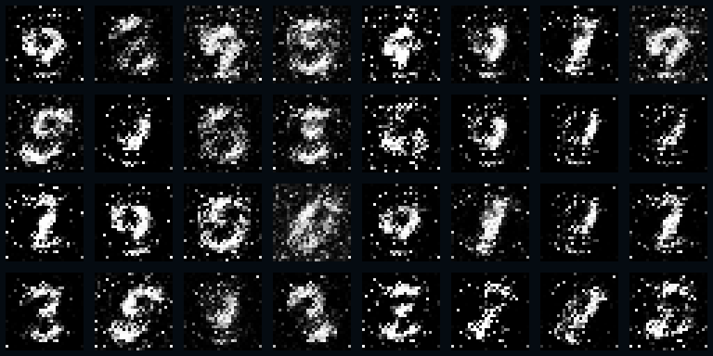
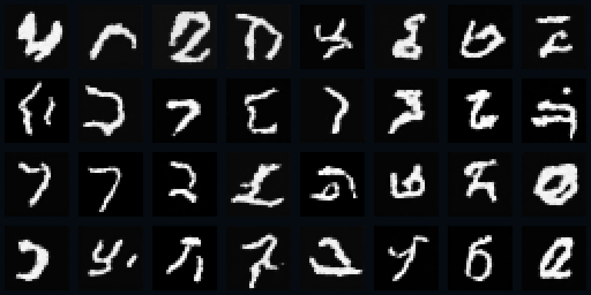

# 第二章：实际保存的实验结果

以下数字来自原始 JSON 与 checkpoint，整理时没有重新训练全量模型，也没有筛除某个种子。实验配置与操作入口见[实验复现](实验复现.md)。

## 二维八峰分布（V5）

来源：[`distributions-v5.json`](../results/distributions-v5.json)，摘要：[`experiment-summary-v5.json`](../results/experiment-summary-v5.json)。GAN 与 DDPM 各使用种子 12、25、2003，训练 6,000 步，评估 2,048 个点。

| 模型 | 种子 | 覆盖区域 | 近邻比例 | 平均最近中心距离 | DDPM 验证噪声 MSE |
|---|---:|---:|---:|---:|---:|
| GAN | 12 | 8/8 | 46.1914% | 0.401046 | — |
| GAN | 25 | 8/8 | 41.0156% | 0.424450 | — |
| GAN | 2003 | 8/8 | 44.6289% | 0.405984 | — |
| DDPM | 12 | 8/8 | 94.0918% | 0.169078 | 0.338036 |
| DDPM | 25 | 8/8 | 94.6289% | 0.163145 | 0.337719 |
| DDPM | 2003 | 8/8 | 93.5059% | 0.171137 | 0.339510 |

“近邻”指距离最近中心小于 0.36；一个中心至少收到 10 个近邻点才算覆盖。本次六次运行都覆盖了 8 个中心，但 GAN 仍有较多样本落在目标区域之外。三种子近邻比例均值分别约为 GAN 43.9453%、DDPM 94.0755%。

GAN、DDPM 的网络、训练目标、batch 和学习率均不同；这张表描述本次教学配置，不能推广为所有生成模型的性能排名。记录的 GAN 耗时为 69.85/62.33/59.54 秒，DDPM 为 29.91/27.05/25.91 秒，包含训练、采样与导出，仅代表当时运行机器，不能作为跨架构速度基准。

## MNIST 手写数字

来源：[`digits.json`](../results/digits.json)。训练种子 **42**，两个模型各更新 3,000 次；DDPM 生成种子 10042，原始运行使用 CUDA、PyTorch 2.11.0+cu128。

| 记录项 | 值 |
|---|---:|
| 训练部分 | 55,000 张 |
| 验证部分 | 5,000 张 |
| 本次噪声 MSE 实际使用的验证图像 | 验证部分的前 512 张 |
| DDPM 时间步 | 200 |
| 保存的固定样本数 | 32 张 |
| DDPM 验证噪声 MSE | 0.0448397025 |

该 MSE 衡量噪声预测误差，不是识别准确率，也不能独立衡量视觉质量。原记录没有 FID、分类准确率或多种子数字实验，不能补写这些指标。损失每 50 步保存一次，最后一个训练损失记录对应 step 2950；最终 checkpoint 对应完成 3,000 次更新。

GAN 训练至 3,000 步的固定样本网格：

DDPM 反向采样结束的同批 32 张图：

完整的 50 张图位于 [`results/digits/`](../results/digits/)，包括 1 张训练样本网格、8 张 GAN 训练阶段图、41 张 DDPM 过程图。每个小格中的原始模型输出为 28×28 灰度图，网格通过最近邻放大展示；没有用其他生成器美化。

## 本次整理的实际核查

63 项历史文件的字节哈希与两份原始源码哈希匹配。读取八个权重后，重新生成了六组二维样本，最大坐标误差约 5.13×10⁻⁶；与原 JSON 的舍入精度一致，区域计数和近邻比例一致。CUDA 上重新执行 MNIST DDPM 的 200 步采样，与保存的终图像素差为 0。详情见[检查报告](../results/verification-2026-09-29.json)。

上述核查重新推理了已保存模型，没有重做完整训练。CPU/CUDA 短运行另用于验证新入口的执行流程，短运行结果不计入上表。

本章将点分布实验、数字生成实验和踏雪角色创作放在同一条学习路线中。这里的点、数字和权重证明小模型的实际行为；踏雪的身份保持与动作连续性需阅读[角色示例说明](图像生成与角色示例.md)中的独立记录。
