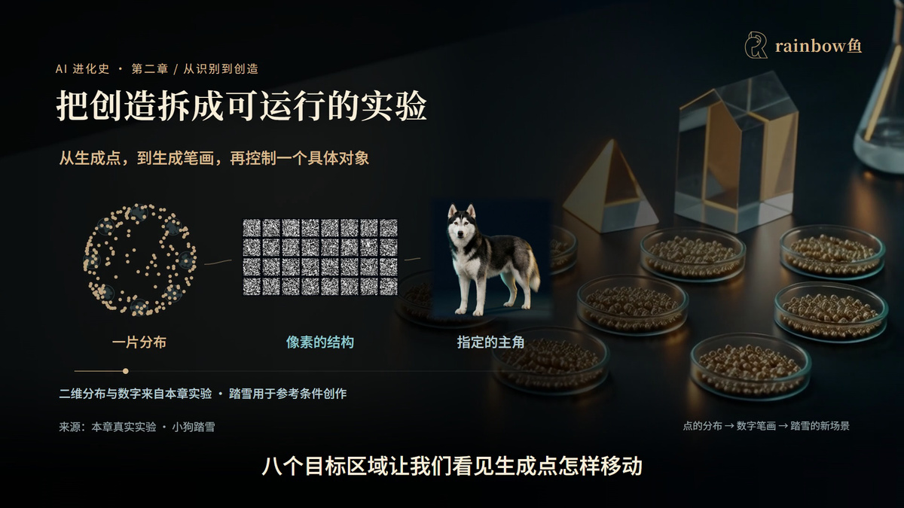
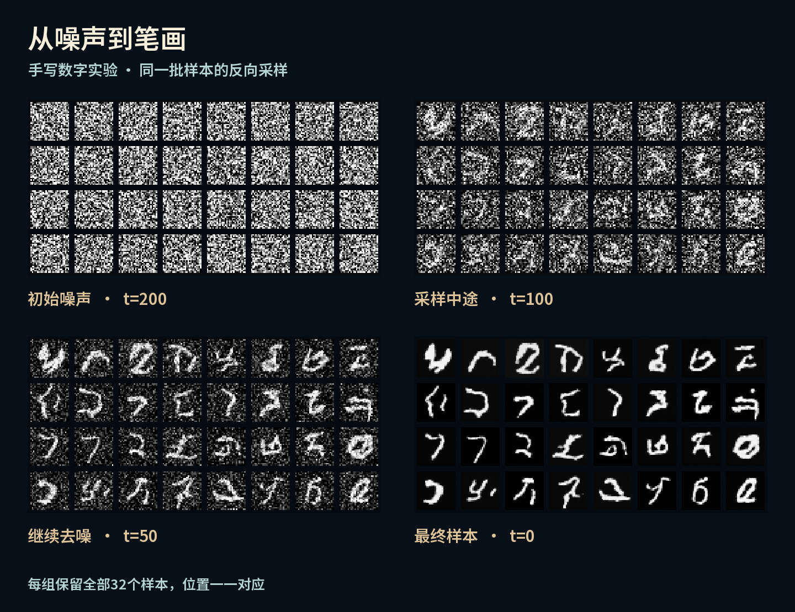

# AI 怎么画出真实图像？从噪声到一只小狗，拆开看

**作者：rainbow鱼**

把照片弄成一团雪花很容易。可如果电脑一开始拿到的，就是这一团雪花，它要怎么画出一只小狗？

更难的问题还在后面：换个背景、换个动作，怎么让画面里的她，仍然像同一只小狗？

她叫踏雪。黑白长毛，棕色眼睛，鼻梁一道白纹，四只白爪。我们就从她出发，把“AI 会画画”这件事拆开看看。

*第二章《从识别到创造》。踏雪是参考条件生成的角色示例。*

## 先把目标缩小：让一群点学会站对位置

一张逼真的图像里，颜色、轮廓、材质和空间关系挤在一起，刚开始很难看清模型到底学了什么。

所以我们先把问题缩成一张平面：真实样本集中在八个区域，模型生成的点一开始散落在别处。训练能不能让它们接近目标？又会不会只挤进其中一个区域，丢掉其他可能性？

这两个问题，也藏在图像生成里：一张结果看起来不错，还不够；我们还希望模型能产生丰富的变化。

*成片01:18的路线画面。二维分布和手写数字来自本章实验，踏雪连接到参考图与条件控制的应用。*

## 第一条路：两个网络，轮流进步

GAN 里有两个角色。

生成器拿到一组随机数，交出一个样本。判别器同时接触真实样本和生成样本，学习区分两种来源。

训练判别器时，生成器先保持不变；训练生成器时，再固定判别器的参数，让生成器沿着反馈调整自己。这样交替进行，生成样本才有机会逐渐靠近真实数据的分布。

有意思的是，这个过程也会走偏。模型可能发现某一种答案容易过关，于是反复给出相似结果。这就是为什么我们要同时看质量与多样性，而不只挑一张最好看的图。

接着，把平面上的点换成28×28的手写数字，训练的变化就落到了具体笔画上。你会看到成功的样本，也会看到还不成形的结果。

## 第二条路：先学会辨认噪声，再逐步生成

扩散模型把问题拆得更细。

训练时，我们拿一张已有图像，加入已知的随机噪声，并告诉网络当前的时间步。网络练习预测加进去的噪声，预测得不准，就根据误差更新参数。

真正生成时，起点换成纯随机噪声。模型根据学到的规律，一步一步调整样本，笔画和轮廓才慢慢出现。

*本章手写数字实验保存的同一批样本，从t=200到t=0的四个检查点。每格位置保持一致，可沿着同一个位置观察笔画变化；保留全部32个样本，没有只挑漂亮结果。*

这里最值得看的是“训练”和“生成”的区别：训练时我们知道噪声从哪里来，能计算误差；生成时，模型只有随机起点和学到的参数，要自己逐步构造结果。

当你看清这一点，再读去噪公式和采样代码，就能把符号与眼前发生的变化对上。

## 怎么让新画面里的她，还是踏雪？

能生成图像以后，新的问题出现了：我想画什么？哪些地方可以改变，哪些特征应该留下？

文字指令、参考图和其他条件，都是把要求交给模型的方式。我们会观察踏雪换场景后的耳朵、白纹、眼睛和体态：背景变了，她的身份线索有没有保住？动作变了，身体结构是否依然自然？

再把一张图延伸成视频，还要考虑时间：前一帧到后一帧，外形和运动能不能接得上？

点和数字让我们看清训练机制；踏雪让我们把问题带回日常使用。两部分放在一起，就更容易理解一次生成到底成功在哪里，又可能在哪一步出错。

## 想继续看，也想自己试

这是《AI 进化史》的第二章。我想用六章，把 AI 怎样发展、它是什么、我们能用它做什么，连成一条看得见的路线。

这一章的完整视频约30分钟，从对抗训练走到逐步去噪，再到潜空间、条件控制和论文阅读。你可以先跟着变化建立直觉，再回头看代码和公式。

系列资料仓库：

https://github.com/rainbowyuyu/AI_revolution

第二章的图文讲义、GAN／DDPM实验、结果记录、小型模型和复现步骤已整理：

https://github.com/rainbowyuyu/AI_revolution/tree/main/chapters/02-generation

可以先读讲义建立直觉，也可以直接跟着复现教程运行。欢迎说说你最想继续展开哪一部分。

---

**音乐与素材**

图示使用本章实验产物和成片画面；封面及踏雪相关场景为参考生成示例。文中采样图没有使用生图模型重绘实验结果。

视频音乐：Bleeping Demo — Kevin MacLeod（incompetech.com），[CC BY 4.0](https://creativecommons.org/licenses/by/4.0/)。本片对原曲做了选段、循环、节奏层次、均衡、渐变与响度处理。[原曲来源](https://incompetech.com/music/royalty-free/index.html?isrc=USUAN2000021)。
