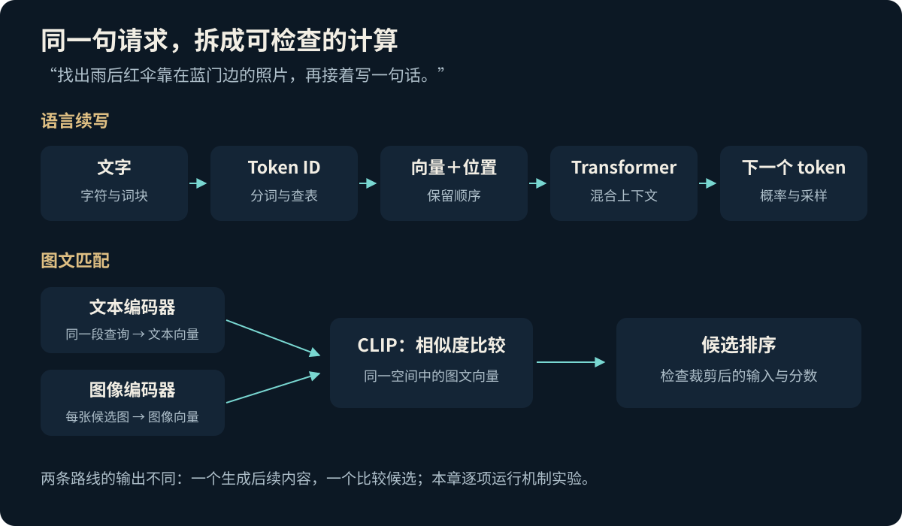
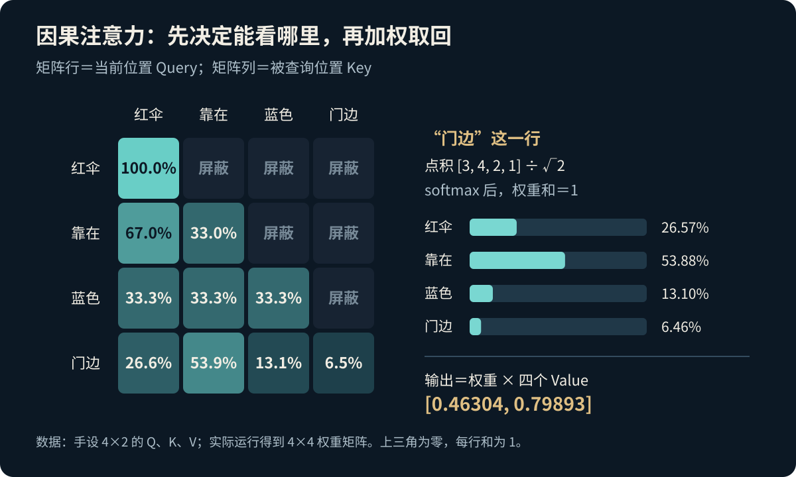
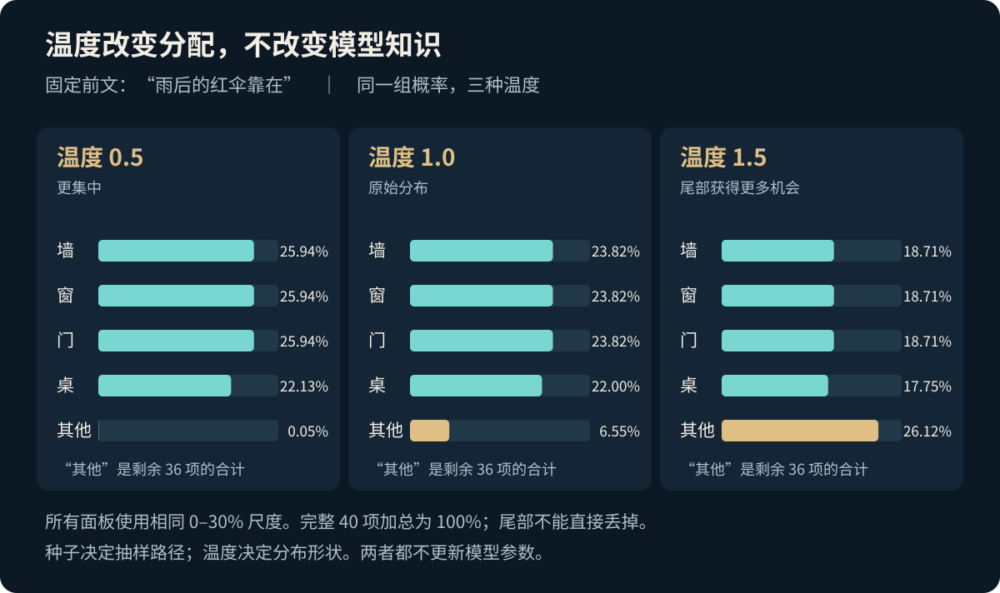
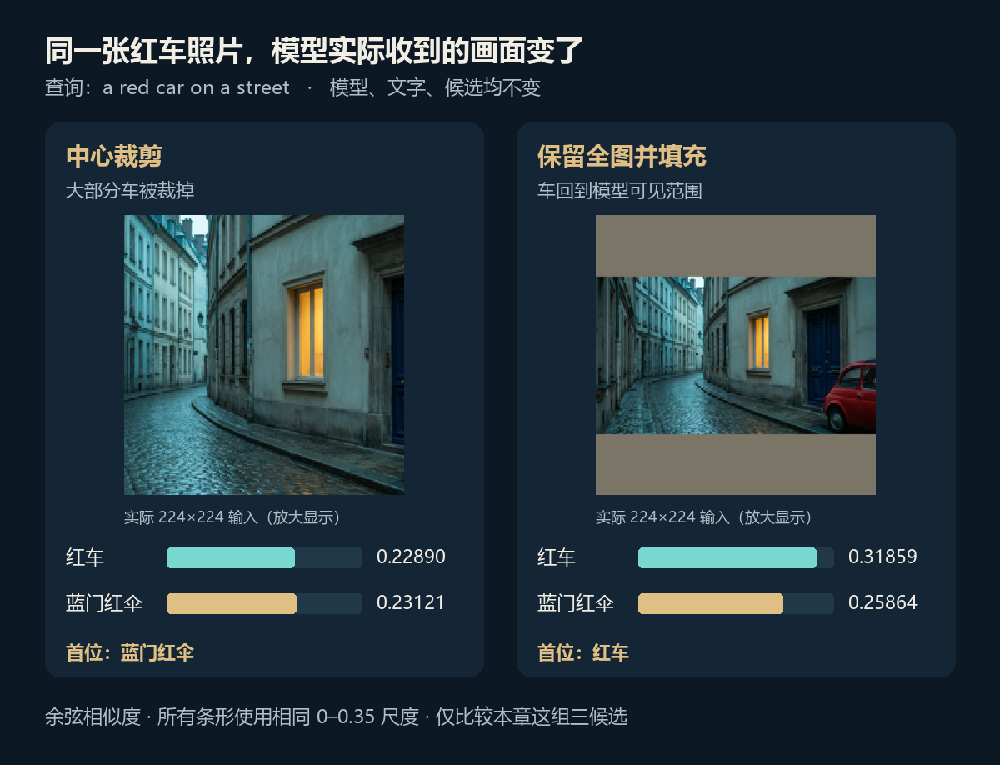

# 第三章图文讲义：让语言、图像与声音建立联系

我们给计算机一个具体任务：**找出“雨后，一把红伞靠在蓝色门边”的照片，再接着写一句话。** 人看起来只需要读一句、瞄一眼，计算机却要完成几种不同的计算：把文字表示成数值，让前后文交换信息，比较文字与图片，再产生下一个符号。

这一章沿着这个任务拆解 Transformer、语言模型、CLIP、指令与偏好训练，以及多模态接口。配套实验分别运行这些机制；它们合起来是一条学习路线，没有把几个小实验包装成一个训练完成的通用助手。

配套入口：[章节首页](../README.md) · [实验复现](实验复现.md) · [实验结果](实验结果.md) · [论文索引](论文索引.md) · [完整口播](../supplements/口播.md) · [时间导航](../supplements/章节时间索引.md)



## 1. 先把文字拆成计算机能处理的单位

模型通常不直接接收屏幕上的汉字，而是接收分词器产生的 **token ID**。Token 可以是一个字、一个子词、一段字符，也可能包含空格；它不必等于中文的“一个词”。

本章先用一个很小的字符 BPE 实验，看合并是怎样发生的。语料是 5 个短句，各重复 3 次。算法从字符开始，反复合并当前最常出现的相邻组合。第一轮 `红 + 伞` 出现 12 次，第二轮 `蓝 + 色` 出现 9 次。执行 14 次合并后得到 36 个词表项。

```text
原句：雨后的红伞靠在蓝色门边。
切分：雨后的 | 红伞靠在 | 蓝色门 | 边。
编号：   33  |    23    |   28   |  30
```

从 ID 还原后与输入完全一致。这个有些出人意料的切分正好说明：合并规则由当前语料的统计决定，不保证每一块都是自然语言词。小语料里经常连着出现的“红伞靠在”就会被合并。

**ID 是查表用的编号。** 33 比 23 大，不意味着它的意思“更多”，两个编号差 10 也不表示语义距离。语义表示来自后面的向量及训练过程。

原始记录：[tokenization.json](../results/tokenization.json)。本例是可检查的字符 BPE 教学实现；现代模型的实际分词器还可能涉及字节编码、归一化、特殊 token 等处理。BPE 进入神经机器翻译的经典工作见 [Sennrich 等，2016](论文索引.md#7-bpe子词单位)。

## 2. 从编号到向量，还要保留位置

假设词表有 $V$ 个 token，模型宽度为 $d$，嵌入表就是一个 $V\times d$ 的矩阵 $E$。编号 $i$ 对应一行：

$$
x_i=E[\mathrm{token\_id}_i].
$$

最初的向量通常只是可训练参数。训练会改变这些数值，使后续计算更容易完成预测任务。我们可以用图形展示它们的相似关系，但不能随意把某一维命名为“红色维”、另一维命名为“物体维”：模型一般把信息分布在许多维度上。

仅有一组 token 向量还不够。“狗追人”和“人追狗”用了同样的字，顺序却改变了意思。模型需要位置信息。

- 2017 年 Transformer 使用位置编码，论文给出正弦、余弦形式，将它加入输入表示。
- RoPE 把位置作用写成对 Query 和 Key 成对分量的旋转，使二者的内积体现相对位置信息。

它们都是让注意力利用顺序的方法，实现并不相同。RoPE 也不是把可见的文字沿屏幕旋转；旋转发生在向量坐标中。原始说明见 [Transformer](论文索引.md#1-transformer注意力与网络结构) 与 [RoFormer](论文索引.md#8-rope位置怎样进入注意力)。

## 3. Q、K、V：先比较，再取回信息

读到“门边”时，模型需要让当前位置与前面的信息发生联系。注意力为每个位置构造三种投影：

$$
Q=XW_Q,\qquad K=XW_K,\qquad V=XW_V.
$$

Query 与 Key 用来计算相容程度，Value 是按权重混合的内容。“提问、索引、内容”是帮助记忆的比喻；真正运行的是矩阵乘法，这些投影也不会自动对应人类规定好的语言角色。

如果一段序列有 $n$ 个位置，$X$ 是 $n\times d$，$W_Q,W_K$ 为 $d\times d_k$，$W_V$ 为 $d\times d_v$，那么分数矩阵 $QK^\mathsf{T}$ 的形状是 $n\times n$。**第 $i$ 行表示第 $i$ 个位置分别如何给各位置打分。**

本章数值实验为了能手算，直接设置四行二维 Q、K、V，行顺序都是“红伞、靠在、蓝色、门边”：

$$
Q=\begin{bmatrix}1&0\\0&1\\1&1\\2&1\end{bmatrix},\qquad
K=\begin{bmatrix}1&1\\2&0\\0&2\\1&-1\end{bmatrix},\qquad
V=\begin{bmatrix}1&0\\0&1\\2&1\\-1&2\end{bmatrix}.
$$

三个矩阵的形状均为 **4×2**；随后得到的分数矩阵才是 **4×4**。这里的四个词块是专门选出的解释单位，和上一节 BPE 实际产生的四块并不是同一套切分。

## 4. 缩放、遮罩与 softmax，各解决一个问题

缩放点积注意力为：

$$
A=\operatorname{softmax}\!\left(\frac{QK^\mathsf{T}}{\sqrt{d_k}}+M\right),
\qquad O=AV.
$$

1. **点积**：Query 与各 Key 计算分数。
2. **缩放**：除以 $\sqrt{d_k}$，缓和维度变大时点积尺度增大的问题。
3. **因果遮罩**：自回归预测里，第 $i$ 个位置只能使用自身与之前的位置。对未来位置令 $M_{ij}=-\infty$，其余位置为 0。
4. **softmax**：逐行把允许位置的分数变成非负、和为 1 的权重。
5. **加权求和**：用这些权重混合 Value，形成输出向量。

遮罩必须在 softmax 前生效。把未来分数改成 0 不够，因为 $e^0=1$，它仍会得到权重。实际程序也常用足够小的有限数或专用遮罩接口；本章 JSON 将被遮罩的无穷值记录为 `null`，`null` 不是“零分数”。



拿最后的“门边”一行算一遍：它的 Query 是 $[2,1]$，与四个 Key 的点积为 $[3,4,2,1]$。除以 $\sqrt2$ 后得到约 $[2.1213,2.8284,1.4142,0.7071]$。最后一个位置没有未来需要遮住，softmax 结果为：

$$
a_{\text{门边}}\approx[0.26565,\ 0.53878,\ 0.13099,\ 0.06458].
$$

用它混合四个 Value：

$$
\begin{aligned}
o_{\text{门边}}={}&0.26565[1,0]+0.53878[0,1]\\
&+0.13099[2,1]+0.06458[-1,2]\\
\approx{}&[0.46304,\ 0.79893].
\end{aligned}
$$

这才是注意力输出：一个新的向量，而不是“选择了某一个词”。softmax 为数值稳定通常先减去该行最大分数，结果不变：

```python
scores = Q @ K.T / sqrt(d_k)
scores[future_positions] = -inf
weights = softmax(scores, axis=-1)
output = weights @ V
```

本例的上三角权重为 0，每行权重和为 1。完整精度见 [causal_attention.json](../results/causal_attention.json)。这些手设数值说明计算过程，权重高低不构成模型已经学会某种句法关系的证据。

<details>
<summary>视频里 6×2 的投影矩阵，怎样对应这里的 4×2 矩阵？</summary>

投影动画单独选取一个六维行向量 $x=[0.34,0.72,-0.17,0.84,0.48,-0.63]$，展示它经过三个不同的 $6\times2$ 投影，分别得到 $q=[2,1]$、$k=[1,-1]$、$v=[-1,2]$，也就是上述“门边”一行。

为了让可视化与保存的目标完全对应，动画按 $W_{rc}=x_r t_c/\sum_i x_i^2$ 构造每个投影矩阵，其中 $t$ 是该投影的二维目标。因此 $xW=t$。这是一个可核算的乘法示范，矩阵并非通过训练学到，也没有由这一个向量生成全部四行 Q、K、V。

</details>

## 5. 从一个注意力头，走到一层 Transformer

单个注意力头只给出一次信息混合。多头注意力用不同投影分别计算，再拼接、线性变换：

$$
\operatorname{MultiHead}(X)=\operatorname{Concat}(\mathrm{head}_1,\ldots,\mathrm{head}_h)W_O.
$$

这些头可以学到不同关系，但设计者通常没有预先规定“第一头管颜色、第二头管位置”。是否存在某种分工需要对具体模型另作分析。

Transformer 层还有几个重要部件：

| 部件 | 做了什么 | 看图时容易误解的地方 |
|---|---|---|
| 残差连接 | 保留原表示，并加上子层输出 | 不是每层把旧信息全部清空 |
| 层归一化 | 对每个位置的特征向量归一化，并使用可学习缩放与偏移 | 不是把 token 之间的关系平均掉 |
| 位置前馈网络 FFN | 对每个位置使用同一组非线性变换 | 参数共享；它本身不在位置之间做注意力混合 |
| 堆叠多层 | 反复更新每个位置的上下文表示 | 层数增加不自动保证任何任务都更好 |

原 Transformer 使用的层后归一化可写成：

$$
H=\operatorname{LN}(X+\operatorname{MultiHead}(X)),\qquad
Y=\operatorname{LN}(H+\operatorname{FFN}(H)).
$$

原论文的 FFN 为两次线性变换，中间使用 ReLU：

$$
\operatorname{FFN}(h)=\operatorname{ReLU}(hW_1+b_1)W_2+b_2.
$$

现代架构常用层前归一化、不同激活或门控结构。解释某个模型时，要区分这些变体和 2017 年原图。原始 Transformer 本身是编码器—解码器架构；后面的 GPT 系列是自回归解码器路线，并非整套原图原封不动地搬过来。

## 6. 下一词预测：训练时怎么给反馈

把语言建模写成“给定前文，预测下一个 token”，整句概率便能分解为：

$$
p_\theta(x_1,\ldots,x_T)=\prod_{t=1}^{T}p_\theta(x_t\mid x_{<t}).
$$

模型输出每个候选 token 的 logit，经 softmax 得到概率。训练使用真实文本的下一项作目标，对目标概率取负对数；平均交叉熵为：

$$
L=-\frac{1}{T}\sum_{t=1}^{T}\log p_\theta(x_t\mid x_{<t}).
$$

例如正确答案的概率从 0.2 变到 0.8，单位置损失就从约 1.609 降到 0.223。训练会沿梯度调整参数，让真实文本的后续内容更容易被预测。

训练时通常把已知文本整体送入，利用因果遮罩并行计算各位置的下一项损失。这常被称为 teacher forcing：前文来自训练文本。生成时则把模型刚输出的 token 接回输入，反复预测，因此一次错误可能改变后续整段内容。

模型规模和训练材料增大后，同一个预测接口能够承载更多任务。例如先给两组“句子 → 情感标签”的示例，再给一条新句子，模型可以利用当前上下文继续输出标签。[GPT-3](论文索引.md#2-gpt-3上下文示例与语言建模) 系统研究了这类少样本使用方式。这些示例改变的是本次输入与条件分布；通常没有在推理中重新训练模型参数，效果也依赖具体任务和示例。

### 用一个小计数模型看清结果

本章实验用字符三元计数模型演示概率与采样，最多参考前两个字符；上下文不足时回退到更短统计。它没有训练 Transformer。语料由 4 种伞颜色、4 个位置和 4 个结尾组合成 64 句，按固定索引留出 13 句，其余 51 句用于计数，使用 $\alpha=0.1$ 的加法平滑。

词表有 40 项，包括 39 个字符与 EOS。留出集共计 234 个预测位置，包含句末 EOS。冻结结果为：

| 模型 | 留出平均负对数似然 NLL | 困惑度 $\exp(\mathrm{NLL})$ |
|---|---:|---:|
| 单字符频率基线 | 3.45096 | 31.53066 |
| 带回退的字符三元模型 | 0.57819 | 1.78281 |

利用相邻上下文，确实比只看整体字符频率更容易预测这套语料。但这些句子高度模板化，低困惑度只说明它在这项受限任务上的预测更好，不等同于开放领域的语言能力。原始结果见 [next_token.json](../results/next_token.json)。

## 7. 温度和随机种子，究竟改变了什么

在固定前文“雨后的红伞靠在”之后，模型给“墙、窗、门”各约 23.82%，给“桌”22.00%，其余 36 项合计约 6.55%。这里“门”并不是唯一的第一名。

温度 $T>0$ 改变采样分布的集中程度：

$$
p_i(T)=\frac{\exp(z_i/T)}{\sum_j\exp(z_j/T)}.
$$

若手头已是概率，也可计算 $p_i(T)=p_i^{1/T}/\sum_jp_j^{1/T}$。温度降低时，高分候选通常更集中；温度升高时，尾部候选获得更多机会。$T=0$ 不能直接代入除法，软件中的“温度零”通常另外实现为贪心选择。



保持采样种子为 12，从“雨后的红伞”开始，实际结果如下：

| 温度 | 生成文本 |
|---|---|
| 0.5 | 雨后的红伞靠在墙边，微风轻轻吹过。 |
| 1.0 | 雨后的红伞靠地面还有雨水。窗新。 |
| 1.5 | 雨后的红伞靠靠在墙边，地面雨空气地面还。 |

上图比较的是固定前文“雨后的红伞靠在”的**单步分布**；表格比较的是从“雨后的红伞”出发的**连续采样**，二者起点不同。完整逐步轨迹见 [sampling_trace.json](../results/sampling_trace.json)。

种子控制随机抽样序列，温度重新分配已有概率，两者都不会更新知识或模型参数。想让模型稳定完成更复杂任务，仍需要更合适的数据、模型、训练和评估，不能只靠调温度。

## 8. 找照片：CLIP 怎么把文字与图片放到一起比较

要找红伞，不能只继续输出下一个字。CLIP 分别用图像编码器和文本编码器产生向量，归一化后用内积比较，也就是余弦相似度：

$$
s(I,t)=\frac{f(I)^\mathsf{T}g(t)}{\|f(I)\|\,\|g(t)\|}.
$$

训练时，一批配对图文构成正例，其余交叉组合充当对比候选。CLIP 同时做“图找文”和“文找图”的对比分类，让配对关系在这批候选中更容易被识别。它不是把每张图片直接翻译成一句固定说明。

本章实际运行了预训练 `openai/clip-vit-base-patch32`，锁定模型及处理器 revision 为 `3d74acf9a28c67741b2f4f2ea7635f0aaf6f0268`。候选只有三张：蓝门边红伞、街道红车、草地上的伞。这三张是用于推理的生成输入图，因此这里只考察这组输入上的检索行为。

实际输入给模型的是英文查询；中文是视频和讲义中的解释：

| 英文查询 | 中文含义 | 默认预处理下的首位结果 |
|---|---|---|
| `a photo of an umbrella` | 一张伞的照片 | 草地伞，余弦 0.31266 |
| `a red umbrella leaning against a blue door after rain` | 雨后红伞靠在蓝门边 | 蓝门红伞，余弦 0.33761 |
| `a red car on a street` | 街道上的红车 | 蓝门红伞，余弦 0.23121；红车为 0.22890 |

最后一行失败了。先别急着只怪文本或模型，还要看**它真正收到的像素**。

### 预处理会把重要内容切掉

默认处理器先把短边缩放到 224，再取中心的 224×224 区域。原红车靠近画面右侧，中心裁剪切掉了大部分车。对照方案先按比例把整张图居中填充到正方形，填充色为 `[123,117,104]`，再送进同一个处理器。



对于相同查询 `a red car on a street`：

| 预处理 | 红车相似度 | 蓝门红伞相似度 | 排第一的候选 |
|---|---:|---:|---|
| 默认中心裁剪 | 0.22890 | 0.23121 | 蓝门红伞 |
| 保留全图并填充 | 0.31859 | 0.25864 | 红车 |

模型、查询和候选没有更换，改变预处理就改变了结果。排查多模态任务时，应同时保存原图、处理后的实际输入和分数；只看原图，很容易误判失败发生在哪里。

再把查询换成“蓝伞靠在红门边”，这三张候选中其实没有正确答案，CLIP 仍将“红伞蓝门”排在第一，其候选 softmax 约为 94.51%。**候选 softmax 不是“这张图正确的概率”。** 封闭候选集总能排出第一；余弦值和归一化分数都需要结合候选范围解释。

查看 [CLIP 完整结果](../results/clip_retrieval.json)、[原始输入图](../assets/inputs/) 与 [六张实际模型输入](../results/clip-inputs/)。CLIP 原理见 [Radford 等，2021](论文索引.md#3-clip把图像和文本对齐)。

## 9. 从会续写，到按要求回答

预训练模型学到大量文本规律，但“最像训练文本的后续”不一定就是用户需要的回答。指令和偏好训练给它更明确的行为反馈。

### SFT：直接示范怎样回答

监督微调提供“指令、上下文、期望回答”。对回答 token 做交叉熵训练；常见实现将输入指令位置的损失遮住，只监督回答部分。具体是否遮住哪些位置，以训练实现为准。

例如指令是“用一句话解释注意力”，示范答案可以是“它根据当前位置与上下文的匹配程度，加权汇总相关信息”。模型通过大量示范学习回答格式与任务方式，不需要把每次使用都变成参数更新。

### RLHF：先学偏好，再优化策略

InstructGPT 的经典流程分为监督微调、收集回答排序并训练奖励模型、使用 PPO 优化语言模型。对同一提示，人工比较两个回答，记偏好回答为 $y_w$、另一回答为 $y_l$，奖励模型可用成对损失：

$$
L_{\mathrm{reward}}=-\log\sigma\!\left(r_\phi(x,y_w)-r_\phi(x,y_l)\right).
$$

策略优化希望提高奖励，同时用相对参考策略的 KL 惩罚约束偏离程度。评分偏好、奖励函数与事实正确性仍是不同问题：回答更讨喜，不保证每个事实都更准。

### DPO：直接使用成对偏好

DPO 使用当前模型与参考模型的回答概率比，直接优化成对偏好目标：

$$
L_{\mathrm{DPO}}=-\mathbb E\!\left[
\log\sigma\!\left(
\beta\log\frac{\pi_\theta(y_w\mid x)}{\pi_{\mathrm{ref}}(y_w\mid x)}
-\beta\log\frac{\pi_\theta(y_l\mid x)}{\pi_{\mathrm{ref}}(y_l\mid x)}
\right)\right].
$$

其中完整回答的概率由各 token 的条件概率相乘得到，实现一般用 log probability 求和。参考模型提供基准，$\beta$ 控制目标中的尺度。经典 DPO 不需要另外训练一个显式奖励模型，再接一个在线 PPO 阶段；它仍需要偏好数据、训练计算和结果评估。

| 方法 | 主要训练材料 | 希望学到什么 |
|---|---|---|
| 预训练 | 大量文本等数据 | 广泛的表示与预测规律 |
| SFT | 指令及示范回答 | 如何完成指令、组织回答 |
| RLHF / DPO | 同一提示下的回答偏好 | 哪些回答行为更符合给定偏好 |

本章这部分是依据 [InstructGPT](论文索引.md#4-instructgpt示范偏好与策略优化) 和 [DPO](论文索引.md#5-dpo直接偏好优化) 的机制讲解，没有声称在配套的小型计数模型上复现大规模偏好训练。

## 10. 多模态：接进来的是表示，还需要学会使用它

CLIP 能比较图文，却不会仅凭这个相似度自动产生长篇回答。要让语言模型用图像信息回答问题，需要把视觉表示接入生成计算，并训练这个连接。

- **LLaVA**：用视觉编码器提取图像特征，通过可学习投影连接到语言模型的表示空间，再进行视觉指令训练。投影后是供网络使用的向量，不是一段完美、无损的文字翻译。
- **Flamingo**：先将视觉特征通过 Perceiver Resampler 转为固定数量的视觉 token，再将门控交叉注意力层插入预训练语言模型。交叉注意力的 Query 来自语言，Key 与 Value 来自视觉，是跨模态的信息交换。
- **Whisper**：将音频变成 log-Mel 频谱，由编码器处理，解码器根据任务相关 token 生成文字。它说明声音怎样成为序列模型的输入，不代表所有现代语音系统都使用同一架构。

自注意力是同一序列内部的联系，交叉注意力则可以让一个序列查询另一组表示。对图像、文字、音频都画几条连线还不够；应问清“输入是什么、输出是什么、哪一部分接受训练、使用什么数据”。论文定位见 [LLaVA](论文索引.md#6-llava视觉指令微调)、[Flamingo](论文索引.md#10-flamingo交错图文与交叉注意力)、[Whisper](论文索引.md#9-whisper声音到文字)。

## 11. 把最初的任务接回来

“找出红伞蓝门的照片，再接一句话”现在可以拆成几个可检查的问题：

1. **文字进来了吗？** 检查分词与还原，确认输入没有损坏。
2. **前后文如何联系？** 检查 Q/K/V 的维度、mask 的位置、softmax 的归一化和实际加权结果。
3. **续写如何产生？** 检查训练目标、候选分布、温度与逐步采样。
4. **图片真的被看完整了吗？** 检查预处理后的像素，再看图文相似度和候选范围。
5. **回答是否遵循任务？** 区分预训练规律、指令示范、偏好训练及多模态连接。

这些检查比“模型是不是懂了”这个笼统问题更容易验证。你可以在配套实验里改一句话、一个分数、一张图的裁剪方式，直接观察结果怎样变化。

<details>
<summary>三个自测问题与答案</summary>

**第一题：未来位置的分数设为 0，再做 softmax，能阻止它泄漏信息吗？**

不能。零分数仍产生正的指数项。应在 softmax 前将不允许的位置屏蔽，令其权重为零。

**第二题：把温度从 1.0 改为 0.5，是否让模型学会了更多知识？**

没有。模型参数不变，改变的是从同一组预测分数抽样的方式。

**第三题：检索第一名的候选 softmax 为 94.51%，能否直接断言图片与问题完全匹配？**

不能。它是这组候选的相对分配；候选可能全部不匹配。还要检查实际输入、候选覆盖和关系细节。

</details>

## 继续阅读与复现

先运行 [实验复现](实验复现.md) 中的无模型机制实验，再选择安装 CLIP 依赖。用 [实验结果](实验结果.md) 对照冻结产物，最后按 [论文索引](论文索引.md) 的阅读顺序回到原文。本章图表均由公开实验记录或原创机制图构成；论文版本、PDF 页码、校验值和论点范围见 [来源台账](source-ledger.json)。
