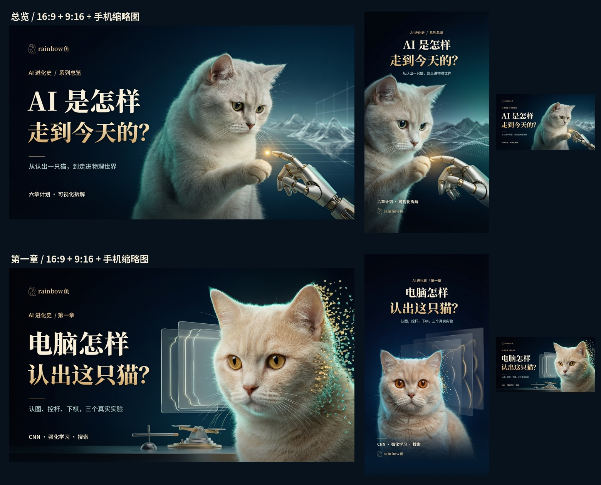

# 2026-09-23 · 共用封面制作记录

总览与第一章的封面和各自文案已分到所属内容目录。这里保留两部作品共同使用的研究、排版程序及一次生成任务的完整记录。

| 内容 | 对应资料 |
|---|---|
| 总览 V11 | [封面与发布文案](../../../overview/publication/2026-09-23/README.md) |
| 第一章 V9 分类引言修正版 | [封面与发布文案](../../../chapters/01-vision-choice/publication/2026-09-23/README.md) |
| 平台研究 | [研究记录](research/封面与平台研究.md) |
| 共用发布建议 | [标题、封面和发布检查](发布方案.md) |
| 生成筛选与估算费用 | [generation-summary.json](generation-summary.json) |
| 可编辑排版 | [compose_covers.py](compose_covers.py)、[layout.json](layout.json) |



生成记录保留原任务时间和原始来源字段；`currentAssetPaths`、`currentFile` 及 `finalImages.file` 指向整理后的现有文件。未选用或生成失败的候选可能只保存记录，没有图片。

## 重新排版

需要 Python、Pillow、NumPy、PyMuPDF，并先恢复 `overview/public/fonts` 下的 Noto 字体。从仓库根执行：

```powershell
python shared/publication/2026-09-23-history/compose_covers.py
```

脚本从 `overview/publication/2026-09-23/artwork/` 与 `chapters/01-vision-choice/publication/2026-09-23/artwork/` 读取底图，各自输出对应 `covers/`；本目录只输出共用布局记录和比较图。脚本不调用生图服务。`rainbow-vector.svg` 为作者既有品牌。

来源日期保持 2026-09-23，目录结构于 2026-09-29 整理；此包不代表已代为发布到 B 站或抖音。
